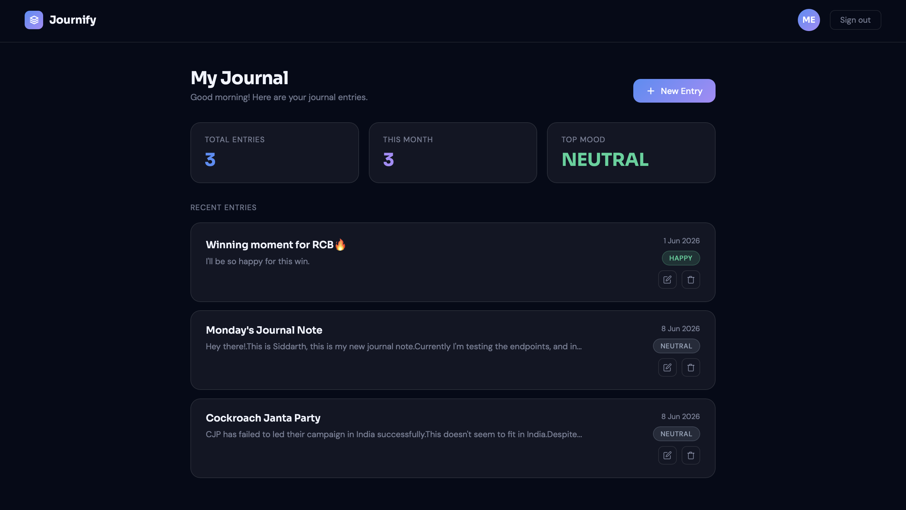
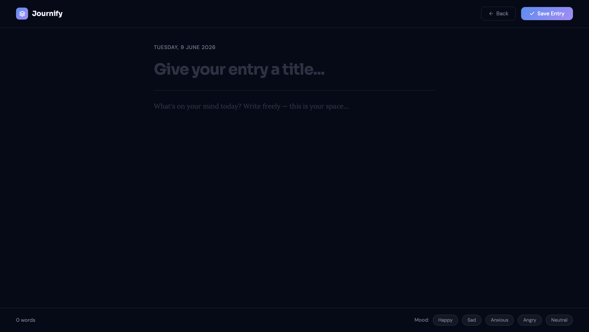

# Journify - Personal Journal Application

Journify is a secure personal journaling web application that helps users write, track, and reflect on their daily thoughts and emotions. It provides mood-based sentiment tracking and delivers automated weekly mood summary reports directly to your inbox.

**Live Demo:** https://journalapp-2pia.onrender.com  
**API Documentation:** https://journalapp-2pia.onrender.com/swagger-ui.html

> Note: The app is hosted on Render's free tier. It may take up to 50 seconds to load on the first visit if the server has been inactive.

---

## Screenshots




---

## Tech Stack

- **Backend:** Java 17, Spring Boot 4.0
- **Authentication:** Google OAuth2, JWT
- **Database:** MongoDB Atlas
- **Caching:** Redis
- **Messaging:** Apache Kafka / Redpanda
- **Frontend:** HTML, CSS, JavaScript
- **Deployment:** Render
- **API Docs:** Swagger / OpenAPI 3.0

---

## Features

- Google OAuth2 login with JWT-based stateless authentication
- Create, read, update, and delete journal entries
- Mood tagging on entries (Happy, Sad, Angry, Anxious, Neutral)
- Dashboard with total entries, monthly count, and top mood stats
- Automated weekly sentiment summary emails via Kafka event streaming
- Redis caching for optimized API response times
- REST APIs documented with Swagger UI

---

## Getting Started

### Prerequisites

- Java 17 or higher
- Maven
- MongoDB Atlas account
- Redis instance
- Google OAuth2 credentials (Client ID and Secret)

### Setup

1. Clone the repository

```bash
git clone https://github.com/Siddarthsid31/journalApp.git
cd journalApp
```

2. Add your environment variables in `src/main/resources/application.properties`

```properties
spring.data.mongodb.uri=YOUR_MONGODB_URI
spring.security.oauth2.client.registration.google.client-id=YOUR_CLIENT_ID
spring.security.oauth2.client.registration.google.client-secret=YOUR_CLIENT_SECRET
jwt.secret=YOUR_JWT_SECRET
spring.redis.host=YOUR_REDIS_HOST
```

3. Run the application

```bash
mvn spring-boot:run
```

4. Open `http://localhost:8081/journal` in your browser

---

## API Endpoints

| Method | Endpoint | Access | Description |
|--------|----------|--------|-------------|
| GET | `/journal/public/health-check` | Public | Health check |
| GET | `/journal/public/google-login` | Public | Google OAuth login |
| GET | `/journal` | Protected | Get all journal entries |
| POST | `/journal` | Protected | Create new entry |
| GET | `/journal/id/{id}` | Protected | Get entry by ID |
| PUT | `/journal/id/{id}` | Protected | Update entry |
| DELETE | `/journal/id/{id}` | Protected | Delete entry |
| GET | `/user` | Protected | Get current user info |

Protected endpoints require a Bearer token in the Authorization header.

---

## Project Structure

```
src/main/java/com/Asterisk/journalApp/
    config/          - Spring Security and JWT configuration
    controller/      - REST API controllers
    entity/          - MongoDB document entities
    filter/          - JWT authentication filter
    repository/      - MongoDB repositories
    service/         - Business logic and service layer

src/main/resources/static/
    - Frontend HTML, CSS, and JavaScript files
```

---

## Author

**Maloth Guna Siddarth**  
GitHub: https://github.com/Siddarthsid31  
Email: Siddarthsid957@gmail.com
